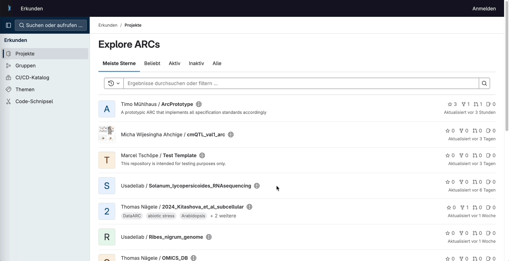

# Getting Started Guide

## Setup

### Prerequisites
To deploy brapi2arc, you need docker installed at least with version 24.0.6 (minor versions might work, but were not tested).

### Personal Access Token
Before you can start using brapi2arc, you need to set up authentication with your GitLab instance:

1. Log in to your DataHUB instance (where your ARC is stored).
1. Generate a Personal Access Token:
    - Go to Edit Profile > Access Tokens
    - Click on "Add new token"
    - Give your token a descriptive name
    - Select an appropriate expiration date
    - Select the necessary scopes (at least `api`)
    - Click "Create personal access token"
1. Store the generated token securely. You'll need it later to authenticate the tool.



## Installation
To install the tool, follow these steps:

1. Clone the repository:
    
    ```sh
    git clone https://github.com/IPK-BIT/brapi2arc.git 
    cd brapi2arc
    ```

1. Set your environment variable. The brapi2arc tool depends on the `ARC_URI` set as an environment variable as well as the personal access token created in the step before. For this create a file `.env`.

    ```sh title=".env"
    ARC_URI='feser/brapi2arc-test-trial'
    DATAHUB_URL='https://git.nfdi4plants.org/'
    DATAHUB_PAT='<YOUR-PERSONAL-ACCESS-TOKEN>'
    ```

1. Build and run the container using Docker:
    
    ```sh
    docker build -t brapi2arc . 
    docker run -p 8080:8080 brapi2arc
    ```

The tool will now be running on `http://localhost:8080`. You can access it via a web browser or use it programmatically.

## Usage
Now that you have the tool installed and authenticated, you can start using it. For detailed information on the BrAPI endpoints, you can visit `http://localhost:8080` (or `http://localhost:8080/schema`) to see the OpenAPI specification. You can also use this to test if everything is working as expected with your ARC.

### Retrieving data
The brapi2arc tool provides access through BrAPI endpoints to the metadata available in your ARC that are required to add observation scoring results. Available endpoints are:

- `POST /search/germplasm`
- `POST /search/variables`
- `GET /programs`
- `GET /trials`
- `GET /studies`
- `GET /studytypes`
- `GET /observationunits`
- `GET /germplasm`
- `GET /variables`

### Writing data
To write data to the ARC, you can use the `POST /observations` endpoint. Using the endpoints above, you need to make sure that the entities like observation units and observation variables exist. 

## Troubleshooting
If you encounter any issues:

- Check that the Docker container is running correctly.
- Verify that your Personal Access Token has the necessary permissions.
- Ensure that your GitLab instance URL and repository name are correct.
- Review the logs for any error messages:
    ```
    docker logs arc-tool
    ```

By following these steps, you should be able to successfully install, set up, and start using the tool to interact with your ARC. Remember to refer to the full [API documentation](api.md) for more detailed information on endpoints and request/response formats.
