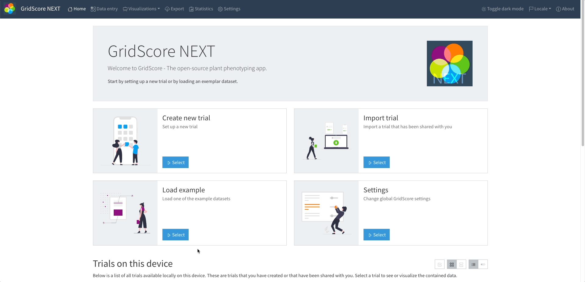

# Simple Example

## Introduction
The following tutorial will show case how to enable [GridScore](https://gridscore.hutton.ac.uk) to write to an [ARC](https://nfdi4plants.org/nfdi4plants.knowledgebase/docs/guides/ARCUserJourney.html) using the brapi2arc tool. This tutorial acts as a reference guide for other phenotyping applications. The brapi2arc tool following the BrAPI specifications, allowing all applications implementing those interfaces to use it. 

## Project setup

### ARC 
In this tutorial, we're going to use an [example ARC](https://git.nfdi4plants.org/feser/jhi-test-data/-/tags/tutorial-start) together. In this example ARC, you'll find two studies with each one having an assay. The first study with observation units has the study design already stored in the ARC, so you can simply import the study into GridScore. The second study without observation units has the study design not yet stored in the ARC, so you'll first need to create a study in GridScore itself and export the study design alongside the observations later. You can either download the ARC and use it as a template for your dataset, or you can follow the [Best Practices](best_practices.md).
```console title="ARC Structure"
data
├── assays
│   ├── with-observation-units
│   │   └── isa.assay.xlsx
│   └── without-observation-units
│       └── isa.assay.xlsx
├── isa.investigation.xlsx
├── metadata.json
└── studies
    ├── with-observation-units
    │   ├── isa.study.xlsx
    │   └── tdf.tsv
    └── without-observation-units
        ├── isa.study.xlsx
        └── tdf.tsv
```

### BrAPI2ARC
Short heads-up: be sure to deploy brapi2arc as shown in the [Getting Started Guide](getting_started.md). For this tutorial, you can fork the example ARC from above and set the `ARC_URI` to your fork. And don't forget to set the `DATAHUB_URL` to `https://git.nfdi4plants.org/`.

### GridScore
Good news! Brapi2arc provides a BrAPI interface, so there's no need to worry about any special integration on GridScore's side. No plugin installation, no specific version – you can simply use the existing BrAPI import and export! For this tutorial, we'll be using the public [GridScore instance](https://gridscore.hutton.ac.uk), but feel free to deploy your own instance and try it with your setup.

## Standard Operating Procedure

### Use Study Design 
In this scenario, the study design is already stored in the ARC, which is great because it means you don't have to worry about it! However, we just need to let GridScore know which observation unit was grown at which location, and we're all set!  
To get this info to GridScore, we just need to import a new trial using the BrAPI import method. This approach is our way of linking the existing study design in the ARC with the specific observations made in GridScore.

The BrAPI import process is pretty straightforward, but there are a few steps to it. First, we just need to prepare the BrAPI parameters by entering the URL and Authorization Token for the brapi2arc instance. Then, GridScore will search for all the available programs, trials, and studies, and you can select the ISA study that you want to write to. Once the BrAPI import is complete, GridScore will be able to extract and display each observation unit at its location in the grid. 


Now it's time to let GridScore know which traits we'd like to use in our experiment. To do this, we simply open the relevant menu, open the BrAPI import, check that the access parameters are set correctly and import the desired parameters of the study.


All you have to do to finish loading the trial is click on the `Create Trial` button and confirm that you want to create the trial. Once you've done that, the trial is prepared and you can load it to start entering the data for the observations.


To add observations in GridScore, you click on the observation unit at its grid position and enter the values for the trait. In this tutorial, we will only add results for the first two observation units, but feel free to fill out the complete grid.


Once you have all observations recorded, you can export the trial results. For this you navigate to the export tab and using, once again the BrAPI interface, you upload all observations into your ARC. This will also create a new commit in your repository, therefore make sure that you send a valid Authorization Token. If you have none, you find a quick guide in the [Getting Started Guide](getting_started.md). When you complete this tutorial, your ARC should have a structure like this.

```console title="ARC Structure"
data/
├── assays
│   ├── with-observation-units
│   │   ├── datasets
│   │   │   └── phenotyping.csv
│   │   └── isa.assay.xlsx
│   └── without-observation-units
│       └── isa.assay.xlsx
├── isa.investigation.xlsx
├── metadata.json
└── studies
    ├── with-observation-units
    │   ├── isa.study.xlsx
    │   └── tdf.tsv
    └── without-observation-units
        ├── isa.study.xlsx
        └── tdf.tsv
```

There is a new directory `datasets` within the `assays/with-observation-units` directory. Here you can find the observations you uploaded from GridScore. The respective `isa.assay.xlsx` has also been updated, adding processes for each observation unit to the result file.

### Create Study Design

In this scenario, we will create the study design in the ARC using GridScore. You can either create a new one, or, like in this tutorial, import an example trial.



Now that we have imported this trial, we see that it already comes with observations. So we don't need to add any observations and can simply start the export to the ARC. 


You might notice that this takes a bit longer and that there are two new commits in your repository. This is because prior to writing the observations to your ARC, it also writes the observation units.

```console title="ARC Structure"
data/
├── assays
│   ├── with-observation-units
│   │   ├── datasets
│   │   │   └── phenotyping.csv
│   │   └── isa.assay.xlsx
│   └── without-observation-units
│       ├── datasets
│       │   └── phenotyping.csv
│       └── isa.assay.xlsx
├── isa.investigation.xlsx
├── metadata.json
└── studies
    ├── with-observation-units
    │   ├── isa.study.xlsx
    │   └── tdf.tsv
    └── without-observation-units
        ├── isa.study.xlsx
        └── tdf.tsv
```